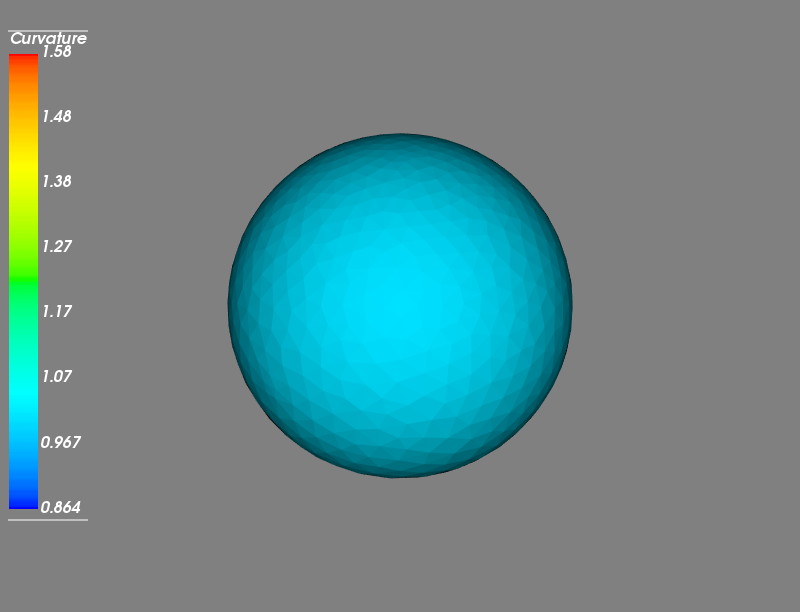
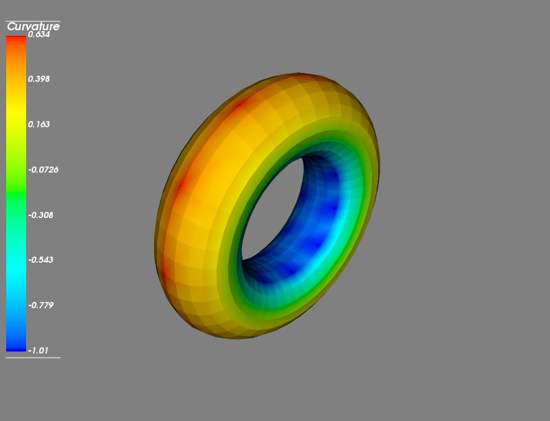

# DiffGeoOps

The project aims to find the principal, mean and gaussian curvatures on triangular meshes using the famous cotangent formula. The implementation is motivated from the following paper.

> http://multires.caltech.edu/pubs/diffGeoOps.pdf

## Requirements
The code uses the following libraries
* numpy
* csv
* mayavi (for plotting)

Make sure to install them before running the code.

> Caution: Currently, the code supports meshes in ``.txt`` and ``.off`` format only.

## Usage
The file **curvature.py** finds all the curvatures (principal, mean and gaussian) given a triangular mesh and stores the curvature values at each vertex of the triangular mesh in a csv file named __output.csv__.

If the mesh is in ``.off`` format, run
```sh
$ python curvature.py <path to off file>
```
If the mesh is in ``.txt`` format, run
```sh
$ python curvature.py <path to vertices.txt file> <path to triangles.txt file>
```
> Caution: The first argument is the file containing vertices and the second argument is the file contatining triangles.

## Plotting
The file **plot.py** shows the plots of the meshes with color scheme according to the value of curvatures. The file **plot.py** reads from the __output.csv__ created by **curvature.py**. Make sure that the csv file is the same directory as **plot.py**.

If the mesh is in ``.off`` format, run
```sh
$ python plot.py <path to off file>
```
If the mesh is in ``.txt`` format, run
```sh
$ python plot.py <path to vertices.txt file> <path to triangles.txt file>
```
> Caution: The first argument is the file containing vertices and the second argument is the file contatining triangles.

## Outputs
The Gaussian Curvature plots of some of the meshes is shown below.



## License 

Copyright (c) 2019 Pranav Jain

For license information, see [LICENSE](LICENSE) or http://mit-license.org

- - -

For bugs in the code, please write to: pranav16255 [at] iiitd [dot] ac [dot] in
